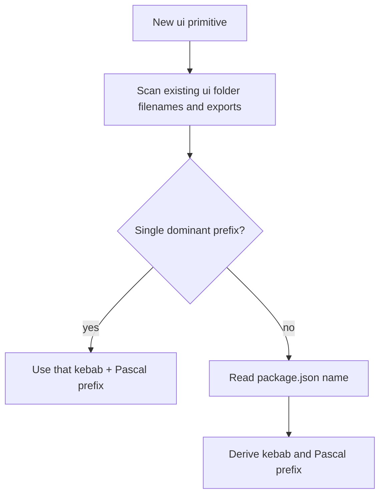

# Frontend Architecture — Reference

A framework- and tool-agnostic architecture pattern engine. Apply to the **open workspace**: scan first, infer conventions, then apply a uniform domain-centric structure. Nothing here assumes a specific framework, UI library, or data layer — those only change file contents, not the structure.

---

## Discovery

Run before any scaffolding.

| Scan | Look for |
|------|----------|
| `package.json` | dependencies (framework, state, data, styling, i18n, test, lint), scripts |
| `tsconfig.json` / `jsconfig.json` | `compilerOptions.paths` (source alias), JS vs TS |
| Workspace files | `pnpm-workspace.yaml`, turbo/nx config (monorepo?) |
| Source folders | route folder, `modules/` or equivalent, test folders |
| File suffixes | `*.service.*`, `*.hook.*`, `*.store.*`, `*.slice.*`, `*.api.*`, `*.types.*` |

Produce a discovery summary (framework, tools, conventions, proposed mapping, confidence) before writing files. If confidence is Low, ask the questions below.

---

## Language: TypeScript vs JavaScript

| Project | Extensions | Types file |
|---------|------------|------------|
| TypeScript | `.ts` / `.tsx` | `<domain>.types.ts` (or `.d.ts` for ambient) |
| JavaScript | `.js` / `.jsx` | none — type via JSDoc if the repo does |

Match whatever the repo already uses. Do not introduce TypeScript into a JS project (or vice versa) without approval.

---

## Architecture layers (mapped to real paths)

| Layer | Holds | Typical path (follow repo) |
|-------|-------|----------------------------|
| routes | Pages / views / route handlers | framework-native (`app/`, `pages/`, `src/routes/`, router config) |
| components | UI primitives + feature compositions | `components/` (ui + feature) |
| modules | Self-contained domain logic | `modules/<domain>/` |
| hooks (consolidated) | Single-domain composites of module hooks | `hooks/consolidated/` |
| hooks (utility) | Domain-agnostic reusable hooks | `hooks/utility/` |
| config | Runtime wiring: instances, env-driven setup, SDK bootstraps | `config/` |
| constants | Static, environment-independent values | `constants/` |
| themes | Styling-system configuration: tokens, recipes, global CSS | `themes/` |
| utils | Pure, domain-agnostic helpers | `utils/` or `lib/` |
| tests | Automated tests | project's runner + placement |

No `state/`, `stores/`, `features/`, or `state/atoms/` placement layer. All domain state lives in `modules/<domain>/`. Individual domain hooks also stay in `modules/<domain>/<domain>.hook.*`; `hooks/` only composes them (consolidated) or holds generic reusable hooks (utility).

---

## Domain module

Every domain is one folder containing everything for that domain.

| File | Responsibility |
|------|----------------|
| `<domain>.service.{ts\|js}` | API/network calls; endpoint map; request functions |
| `<domain>.hook.{ts\|js}` | Data/query hooks and domain orchestration |
| `<domain>.store.{ts\|js}` | Client/global state for the domain (only when needed) |
| `<domain>.types.{ts\|d.ts}` | Request/response + domain types (TS only) |
| `<domain>.utils.{ts\|js}` | Domain-only pure helpers (optional) |
| `index.{ts\|js}` | Barrel when the domain is widely imported |

Match an existing variant suffix if the repo uses one (e.g. `*.api.ts`), and keep it consistent across all domains.

### Example: `order` domain

```text
modules/order/
├── order.service.ts
├── order.hook.ts
├── order.store.ts
├── order.types.ts
└── order.utils.ts
```

---

## Hooks layer

Two folders under `hooks/`. Domain hooks themselves stay in `modules/<domain>/<domain>.hook.*` — this layer never owns domain logic.

| Folder | Holds | File | Export |
|--------|-------|------|--------|
| `hooks/consolidated/` | Single-domain composites | `use-consolidated-<domain>.{ts\|js}` | `useConsolidated<Domain>` |
| `hooks/utility/` | Domain-agnostic reusable hooks | `use-<thing>.{ts\|js}` | `use<Thing>` |

- File names are kebab and mirror the export; extensions follow detected TS/JS.
- `consolidated/` composes existing module hooks into one hook; it must not redefine domain logic.
- Composites are **single-domain**. If a cross-domain composite seems warranted (e.g. a checkout view needing order + cart + payment), **ask the user** how they want to handle it before creating one.

```typescript
// hooks/consolidated/use-consolidated-order.ts
import { useOrderId, useOrderDetails, useCartCount } from "{srcAlias}/modules/order/order.hook";

export const useConsolidatedOrder = () => {
  const orderId = useOrderId();
  const orderDetails = useOrderDetails();
  const cartCount = useCartCount();
  return { orderId, orderDetails, cartCount };
};
```

```typescript
// hooks/utility/use-countdown.ts
export const useCountdown = (seconds: number) => {
  // generic, domain-agnostic timer logic
};
```

---

## Config & constants

### config/ — runtime wiring

Instances and environment-driven setup. Side effects and `"use client"` are allowed here.

| File | Holds |
|------|-------|
| `config/http-client.{ts\|js}` | HTTP client instance + interceptors (auth headers, content-type) |
| `config/query-client.{ts\|js}` | Query/cache client factory + defaults |
| `config/client-cookies.{ts\|js}` / `config/server-cookies.{ts\|js}` | Cookie adapters |
| `config/<sdk>-config.{ts\|js}` | Third-party SDK bootstrap |

```typescript
// config/http-client.ts — instance + interceptor, reads env (axios shown as an example)
import axios from "axios";
import { customFetchClientCookies } from "{srcAlias}/config/client-cookies";
import { COOKIES_NAMES } from "{srcAlias}/constants/cookies-info.const";

export const httpClient = axios.create({
  baseURL: process.env.NEXT_PUBLIC_API_BASE_URL,
  headers: { "Content-Type": "application/json" },
});

httpClient.interceptors.request.use((config) => {
  const [token] = customFetchClientCookies([COOKIES_NAMES.TOKEN]);
  if (token) config.headers.Authorization = `Bearer ${token}`;
  return config;
});
```

### constants/ — static values

Fixed, environment-independent data. Prefer `as const` + derived types.

| File | Holds |
|------|-------|
| `constants/route-path.const.{ts\|js}` | Route paths / URL builders |
| `constants/storage.const.{ts\|js}` | Storage keys |
| `constants/feature-flag.{ts\|js}` | Feature-flag keys (+ derived type) |
| `constants/time-day.const.{ts\|js}` | Durations |
| `constants/default.const.{ts\|js}` | Default UI values |

```typescript
// constants/storage.const.ts — keys as const
export const LS_KEYS = {
  USER_STORE: "app_user_store",
  GENERAL_STORE: "app_general_store",
} as const;
```

```typescript
// constants/feature-flag.ts — keys + derived type
export const FEATURE_FLAGS = {
  ORDERS: "app.feat-orders",
  STORE_PAGE: "app.feat-store-page",
} as const;

export type TFeatureFlag = (typeof FEATURE_FLAGS)[keyof typeof FEATURE_FLAGS];
```

### Choosing between them

| Question | Folder |
|----------|--------|
| Creates an instance / client / singleton? | `config/` |
| Reads `process.env` or runtime values? | `config/` |
| Bootstraps a third-party SDK? | `config/` |
| Fixed keys, enums, paths, durations, defaults? | `constants/` |
| Pure data with no runtime behavior? | `constants/` |

Create either folder only when the project needs it; match the repo's existing suffix (`*.const.*` vs plain).

Styling values are the exception: design tokens (colors, fonts, durations used by the styling system) belong in `themes/tokens/`, not `constants/`.

---

## Themes

All styling-system configuration lives in `themes/`. The structure is uniform; the detected styling tool decides which subfolders apply and what the files contain.

```text
themes/
├── tokens/
│   ├── colors.ts
│   ├── fonts.ts
│   ├── animations.ts
│   └── keyframes.ts
├── semantic-tokens/
│   ├── colors.ts
│   └── index.ts
├── recipes/           # single-part components: button.ts, badge.ts, input.ts, index.ts
├── slot-recipes/      # multi-part components: dialog.ts, card.ts, alert.ts, index.ts
├── global-css.ts
└── index.ts           # assembles + exports the theme/system
```

| Subfolder / file | Holds |
|------------------|-------|
| `tokens/` | Raw design tokens: color scales, font stacks, animation values, keyframes |
| `semantic-tokens/` | Role-based tokens mapped to raw tokens (`bg.primary` -> `colors.blue.500`) |
| `recipes/` | Style recipes for single-part components, one file per component |
| `slot-recipes/` | Style recipes for multi-part components, one file per component |
| `global-css.ts` | Global styles / resets |
| `index.ts` | Theme/system assembly and export (e.g. Chakra `createSystem`, theme object) |

### Tool mapping — same location, tool decides which subfolders exist

| Detected tool | What `themes/` contains |
|---------------|-------------------------|
| Chakra v3 / Panda CSS | All subfolders. `index.ts` calls `createSystem`/`defineConfig` with tokens, semantic tokens, recipes, slot recipes, global CSS |
| Tailwind | `tokens/` (+ `semantic-tokens/` if roles are mapped); token files imported into `tailwind.config.*` or `@theme`; no recipe folders |
| styled-components / Emotion / vanilla-extract | `tokens/`; `index.ts` exports the theme object consumed by the provider |
| CSS modules / plain CSS | `tokens/` as CSS custom properties or exported values; `global-css` |
| None detected | Do not create `themes/`; ask before introducing a styling system |

Never scaffold `recipes/` or `slot-recipes/` for a tool with no recipe concept.

### Example (Chakra v3)

```typescript
// themes/recipes/button.ts — single-part recipe
import { defineRecipe } from "@chakra-ui/react";

export const buttonRecipe = defineRecipe({
  base: { fontWeight: "medium", borderRadius: "md" },
  variants: {
    visual: {
      solid: { bg: "bg.primary", color: "fg.inverted" },
      outline: { borderWidth: "1px", borderColor: "border.primary" },
    },
  },
});
```

```typescript
// themes/index.ts — assembly stays here; config/ or the provider only wires it in
import { createSystem, defaultConfig, defineConfig } from "@chakra-ui/react";
import { colors, fonts, animations, keyframes } from "./tokens";
import { semanticTokens } from "./semantic-tokens";
import { recipes } from "./recipes";
import { slotRecipes } from "./slot-recipes";
import { globalCss } from "./global-css";

const config = defineConfig({
  globalCss,
  theme: {
    tokens: { colors, fonts, animations, keyframes },
    semanticTokens,
    recipes,
    slotRecipes,
  },
});

export const system = createSystem(defaultConfig, config);
```

Rules:

- `themes/index.ts` builds and exports the system; app wiring (provider setup) lives in `config/` or the framework's provider location.
- One file per component recipe; each subfolder exposes a barrel `index.ts`.
- New component styles go in `recipes/` or `slot-recipes/` (recipe-based tools), not inline in component files, when the repo styles via the theme.
- Match the repo's existing file naming inside `themes/` if it already has one.

---

## Inference matrix (tool decides contents, same location)

Precedence: existing repo convention > this matrix > minimal default.

### State — always in `<domain>.store.*`

| Detected tool | What goes in the store file |
|---------------|------------------------------|
| Zustand | `create(...)` store + selectors |
| Redux Toolkit | `createSlice` (state, reducers, selectors); register slice in the existing root store, do not relocate |
| MobX | observable store class / `makeAutoObservable` |
| Jotai / Recoil / atomic | domain atoms grouped in the file |
| None detected | no global state; keep state local; ask before adding a library |

### Data fetching — always in `<domain>.hook.*`

| Detected tool | What goes in the hook file |
|---------------|----------------------------|
| React Query / SWR | query + mutation hooks; colocated query keys |
| RTK Query | endpoints injected into the domain API; generated hooks re-exported here |
| None detected | thin hooks that wrap the service and manage local state |

### Examples

Zustand store (`order.store.ts`):

```typescript
import { create } from "zustand";

export const useOrderStore = create<OrderState>((set) => ({
  selectedId: null,
  setSelectedId: (selectedId) => set({ selectedId }),
}));
```

RTK slice (`order.store.ts`) — registered in the app's existing root store:

```typescript
import { createSlice } from "@reduxjs/toolkit";

export const orderSlice = createSlice({
  name: "order",
  initialState: { selectedId: null as string | null },
  reducers: {
    setSelectedId: (state, action) => {
      state.selectedId = action.payload;
    },
  },
});

export const { setSelectedId } = orderSlice.actions;
```

Service (`order.service.ts`) — uniform regardless of state/data tool:

```typescript
import { httpClient } from "{srcAlias}/config/http-client";

const orderBasePath = "/api/orders";
const orderEndpoint = {
  list: `${orderBasePath}/list`,
} as const;

export const fetchOrderList = async (params) => {
  const { data } = await httpClient.get(orderEndpoint.list, { params });
  return data;
};
```

Replace `{srcAlias}` and `httpClient` with the project's alias and HTTP client.

Data hook (`order.hook.ts`) with React Query:

```typescript
export const ORDER_KEYS = {
  base: ["orders"] as const,
  list: (params: unknown) => [...ORDER_KEYS.base, "list", params] as const,
};

export const useOrderList = (params) =>
  useQuery({ queryKey: ORDER_KEYS.list(params), queryFn: () => fetchOrderList(params) });
```

---

## UI prefix

Resolve before adding new UI primitives.



- **Detect:** longest shared kebab prefix in the UI folder (`acme-shop-dialog` -> `acme-shop`); Pascal from exports (`AcmeShopDialog` -> `AcmeShop`). Majority wins; tie -> prefer barrel exports.
- **Derive from `package.json` name:** strip scope (`@org/acme-shop` -> `acme-shop`); kebab for files; Pascal by capitalizing each `-`/`_` segment.

| Artifact | Pattern |
|----------|---------|
| File | `{kebab}-{thing}.{tsx\|jsx}` |
| Export | `{Pascal}{Thing}` |
| Barrel | UI `index` file when widely reused |

Do not rename existing components unless asked. New primitives go in the UI layer, not feature folders.

---

## Path alias

Read `compilerOptions.paths` and use the alias that maps to the source root.

| paths entry | Use |
|-------------|-----|
| `"@/*": ["./src/*"]` | `@/` |
| `"@source/*": ["./src/*"]` | `@source/` |

Use the project's alias in all imports and when grepping during deletes. Do not invent an alias the project does not define.

---

## Component layering

| Layer | Role |
|-------|------|
| Primitive (UI folder) | Reusable, presentational, no data fetching |
| Orchestrator (shared/feature) | Wires data and domain hooks into primitives |

Keep new design-system primitives in the UI layer; features compose them.

---

## Minimal-delta scaffolding

- Create only what the task and inferred stack need.
- Omit `<domain>.store.*` when there is no domain state; omit i18n/theme files when those tools are absent.
- Reuse the nearest existing convention; document any tie-break.
- Do not move/rename broad areas unless a refactor is explicitly requested.

---

## Clarification questions

Ask when the repo is new/empty, conventions conflict, a whole-project refactor is requested, or new tooling would be required.

### New / empty project

1. Which framework and router?
2. Which state approach for domain stores (Zustand, RTK, MobX, atomic, none)?
3. Which data-fetching approach (React Query, RTK Query, SWR, none)?
4. TypeScript or JavaScript?
5. Which styling system (Chakra, Panda, Tailwind, styled-components, CSS modules, none)?
6. i18n now? If yes, which library and which locales?
7. Which test runner, and centralized vs colocated tests?
8. Confirm the domain convention: `modules/<domain>/<domain>.{service,hook,store,types}.*`?

### Whole-project refactor

1. Scope: full repo or selected domains?
2. Moving/renaming files allowed, or incremental only?
3. May existing `state/` `stores/` `features/` folders collapse into `modules/<domain>/`?
4. Are dependency changes allowed?
5. Any non-negotiable conventions to keep?
6. Preserve old import paths via barrels/shims during migration?
7. Rollout: big-bang or phased per domain?

### Tie-breakers (single question each)

- "I found both `features/` and `modules/` for domain logic — collapse everything into `modules/<domain>/`?"
- "I found both Jest and Vitest — which runner should new tests follow?"
- "Multiple `src` aliases exist — which is canonical?"
- "Repo uses `*.api.ts`, not `*.service.ts` — keep `*.api.ts` for consistency?"

---

## Refactor migration example

Goal: collapse a scattered domain into a single module folder.

Before:

```text
src/
├── features/order/orderSlice.ts
├── stores/order.ts
├── services/orderApi.ts
└── hooks/useOrders.ts
```

After:

```text
src/modules/order/
├── order.service.ts   # from services/orderApi.ts
├── order.hook.ts      # from hooks/useOrders.ts
├── order.store.ts     # from features/order/orderSlice.ts (+ stores/order.ts)
└── order.types.ts
```

Steps:

1. Confirm scope and that moves/renames are allowed.
2. Create `modules/order/`, move logic in, keep file contents (slice stays a slice, store stays a store).
3. Re-register the RTK slice in the existing root store from its new path.
4. Add temporary barrels/shims at old paths if other code imports them, then update importers.
5. Run tests after each domain migrates; remove shims once importers are updated.

---

## Testing

| Concern | Default pattern (when no repo convention) |
|---------|-------------------------------------------|
| Pure logic | `*.unit.test.*` |
| Hooks | `*.hook.test.*` |
| Components | `*.component.test.*` |
| Routes/pages | `*.route.test.*` |

- Use the project's existing runner (Vitest, Jest, etc.) and placement (centralized vs colocated). Defaults apply only when the repo has no pattern.
- Use the project's source alias in tests; reuse existing setup/test-utils when present.
- Update a `TESTING.md` in the same task when the repo maintains one.

---

## Delete checklists

### Component

1. Remove component file(s) and barrel exports.
2. Grep import paths via the source alias; remove dead references.
3. Remove dedicated static assets.

### Domain / feature

1. Delete `modules/<domain>/`; grep `{srcAlias}/modules/<domain>` and hook/store names.
2. Remove the route/view and any route-tied composition.
3. If RTK, unregister the slice from the root store.
4. Remove i18n namespaces (if i18n is used) and their registrations.
5. Remove barrels and dedicated assets.
6. Remove or update tests that referenced the feature.

---

## Example stacks (illustrative, not mandates)

These show how the same structure adapts. Detect and follow the repo instead of copying these.

- **Next.js + React Query + Zustand (TS):** routes in `app/`; `modules/<domain>/<domain>.service.ts` + `.hook.ts` (query keys) + `.store.ts` (zustand) + `.types.ts`.
- **Vite + React + RTK + RTK Query (TS):** routes via router config; `<domain>.store.ts` is a slice (registered in root store); `<domain>.hook.ts` re-exports RTK Query hooks; `<domain>.service.ts` holds non-RTK calls if any.
- **Plain React + SWR + no global state (JS):** `modules/<domain>/<domain>.service.js` + `.hook.js` (SWR); no `.store.js`, no `.types`.

Optional concerns (i18n, theming, PWA, URL-state) are added only when the project uses them, following the repo's existing setup.
